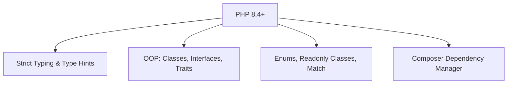
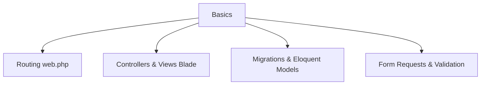
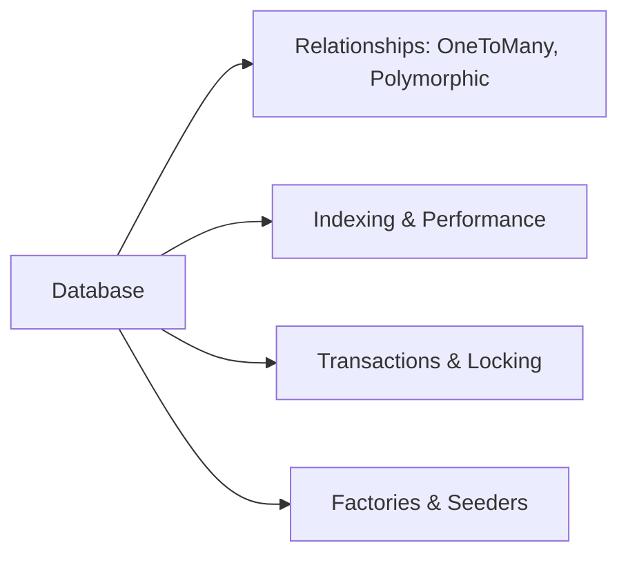
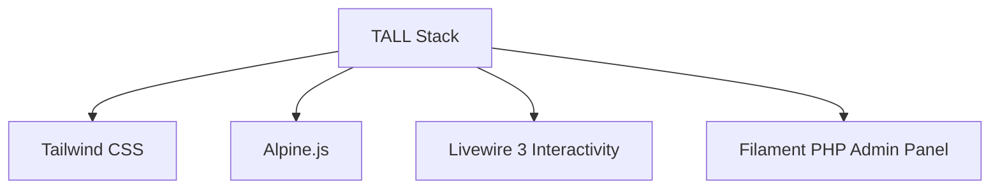
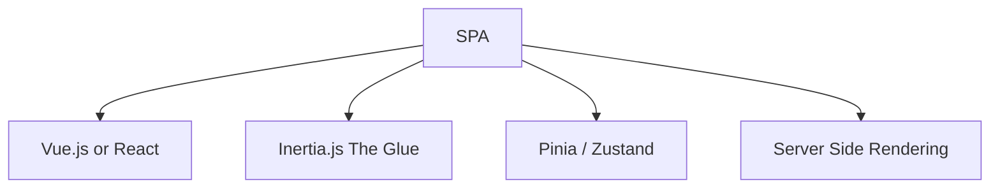
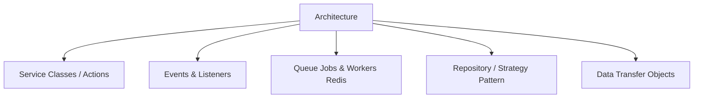
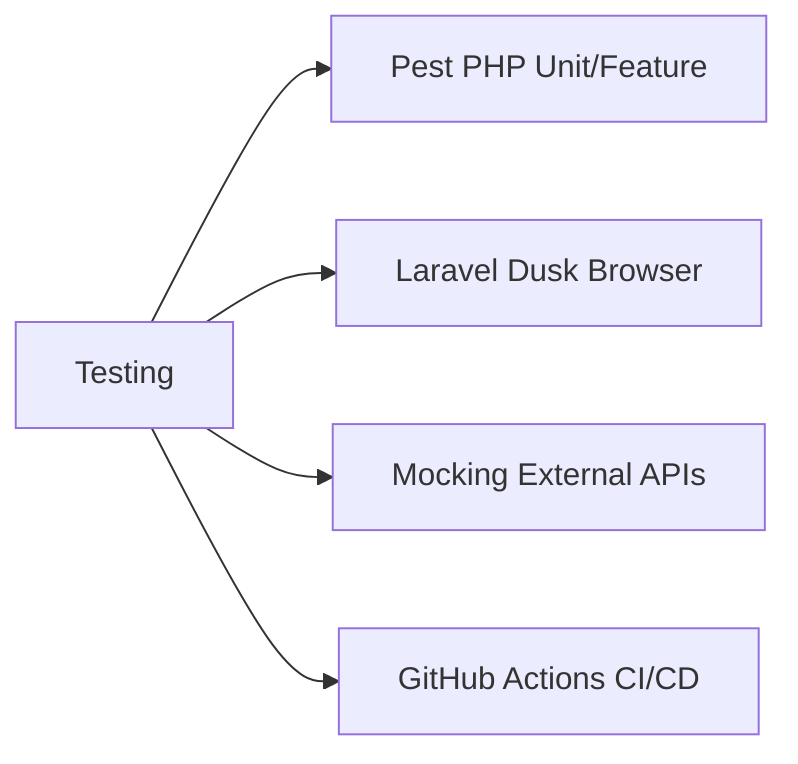
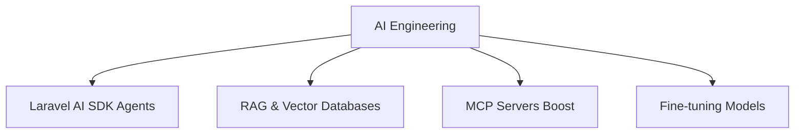
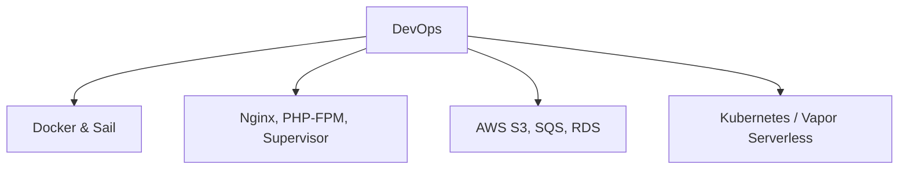

# 🎯 The Complete Full Stack Laravel Developer Roadmap (2026 Edition)

> **"From Zero to Laravel Architect."**
> A comprehensive, visual, step-by-step guide to becoming a highly paid, enterprise-ready developer.

---

## 🟢 Phase 1: The Foundation (Months 1-2)
**Goal**: Build a functional CRUD application without copying code.

### 1.1 Core PHP (Modern)
Before Laravel, you must know PHP 8.4+.


### 1.2 Laravel Basics
The framework fundamentals.


**Projects to Build:**
1.  **To-Do List**: CRUD, validation.
2.  **Personal Blog**: Auth (Breeze), Posts, Comments.

---

## 🟠 Phase 2: The Professional (Months 3-6)
**Goal**: Write clean, testable, and robust code.

### 2.1 Database Mastery
Stop writing N+1 queries.


### 2.2 Frontend Choices (The Stack)
Pick ONE path and master it. Don't learn everything.

**Path A: TALL Stack (Simplicity)**


**Path B: VILT/I Stack (SPA Power)**


**Projects to Build:**
3.  **E-Commerce Store**: Shopping Cart (Session), Stripe Checkout.
4.  **Project Management Tool**: Teams, Roles (Spatie), Task Drag & Drop.

---

## 🔴 Phase 3: The Senior Developer (Months 6-12)
**Goal**: Scale applications and handle complex business logic.

### 3.1 Architecture & Patterns
Move logic out of Controllers.


### 3.2 Testing (TDD)
Sleep well at night.


**Projects to Build:**
5.  **SaaS Starter Kit**: Subscriptions (Cashier), Invoices (PDF), API Tokens (Sanctum).
6.  **Real-Time Chat**: WebSockets (Reverb), Presence Channels.

---

## 🟣 Phase 4: The Architect (Year 2+)
**Goal**: Design systems, optimize infrastructure, and lead teams.

### 4.1 AI Engineering (New Core Skill)
Build intelligent apps.


### 4.2 DevOps & Infrastructure
Own the deployment pipeline.


### 4.3 Advanced Performance
Handle millions of requests.
```mermaid
graph LR
    Perf --> Octane[Laravel Octane (Swoole)]
    Perf --> Cache[Redis Caching Strategies]
    Perf --> DB_Scale[Read Replicas & Sharding]
    Perf --> Search[Meilisearch / ElasticSearch]
```

**Projects to Build:**
7.  **Video Transcoding Platform**: Job Chains, FFMpeg, S3 Storage.
8.  **Multi-Tenant CMS**: Single DB vs Multi DB Tenancy.

---

## 🗺️ Summary Checklist

| Skill | Junior | Mid-Level | Senior | Architect |
| :--- | :---: | :---: | :---: | :---: |
| **PHP** | Basics | 8.4 Features | Attributes/Generators | Extensions/JIT |
| **Laravel** | MVC, Routes | Eloquent, Middleware | Service Container, Macros | Custom Drivers |
| **Frontend** | HTML/CSS | Tailwind/Alpine | Livewire/Inertia | State Management |
| **Database** | MySQL Basics | Relations, Seeders | Indexing, Transactions | Sharding, Replication |
| **Testing** | Manual | PHPUnit Basics | TDD/Pest, CI/CD | Mutation Testing |
| **DevOps** | Shared Hosting | Forge/DigitalOcean | Docker/AWS | Vapor/K8s/Terraform |
| **AI** | ChatGPT | OpenAI API | RAG/Vectors | Custom Agents/MCP |
