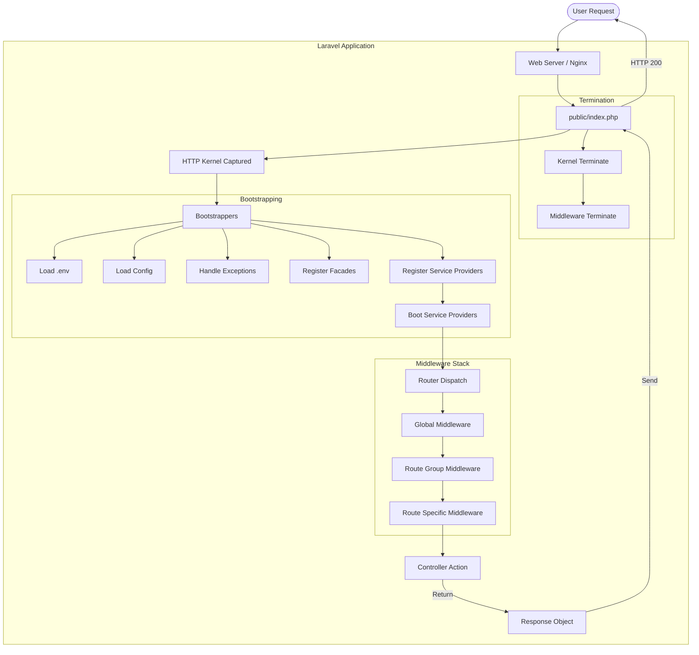

# 📊 01 - Request Lifecycle Diagram

### 🧐 Explanation
This diagram shows the complete journey of an HTTP request.
From the moment it hits `public/index.php`, through the kernel, middleware stack, controller, and back to the user.

