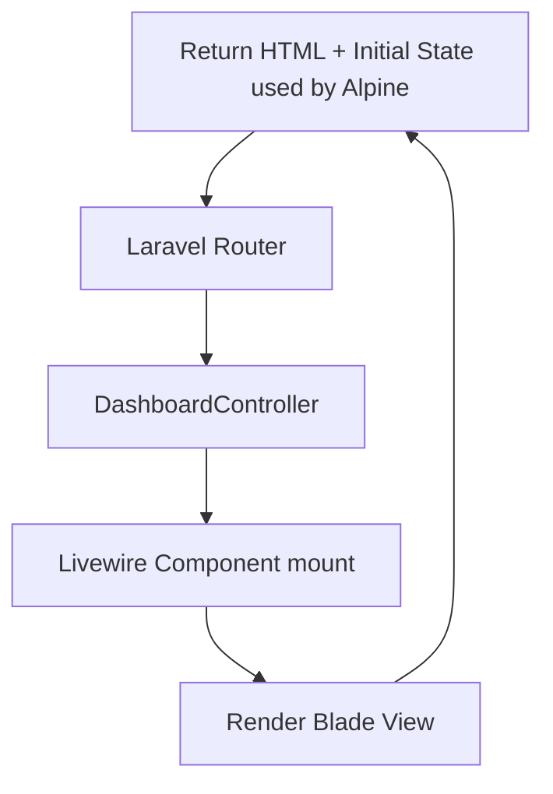
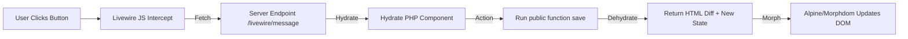
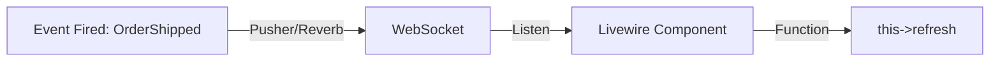

# 🎨 TALL Stack Architecture (Tailwind, Alpine, Laravel, Livewire)

> **"The Monolith Feel, The SPA Power."**
> Understanding how Livewire hydrates the DOM and communicates with the server.

---

## 🟢 1. The Initial Load (Server Side Rendering)
Livewire renders the initial HTML on the server, just like a standard Blade view.



## 🔄 2. The Lifecycle (User Interaction)
When a user types or clicks, Livewire sends an AJAX request.



## 🤝 3. Alpine.js Integration (Entangle)
Sharing state between PHP and JavaScript without network requests (for some parts).

```mermaid
graph TD
    PHP[Livewire count] <-->|@entangle| Alpine[Alpine x-data count]
    Alpine -->|Immediate Update| UI[Update span instantly]
    Note[Network Request happens in background if needed]
```

## ⚡ 4. Real-Time Broadcasting (Echo)
Listening for server events.


