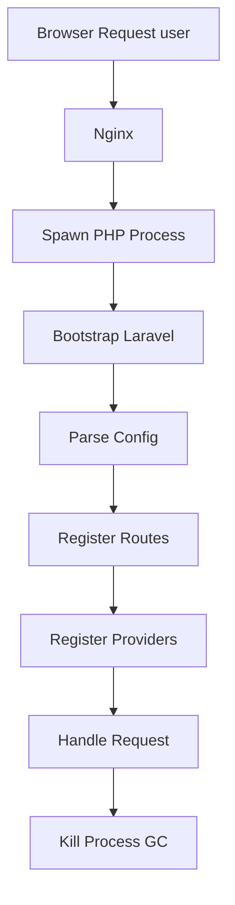
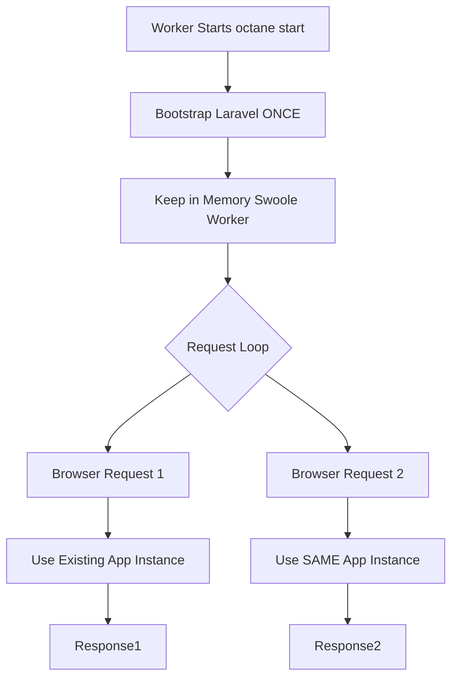
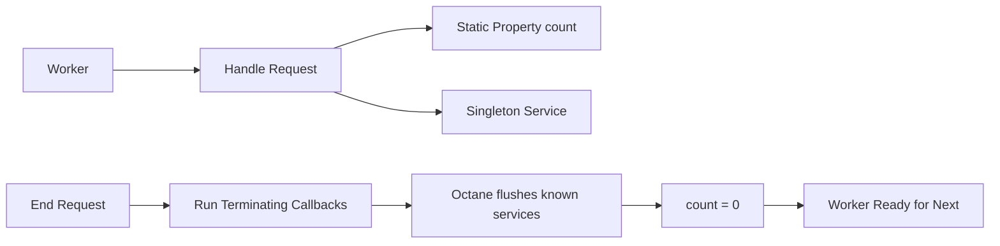
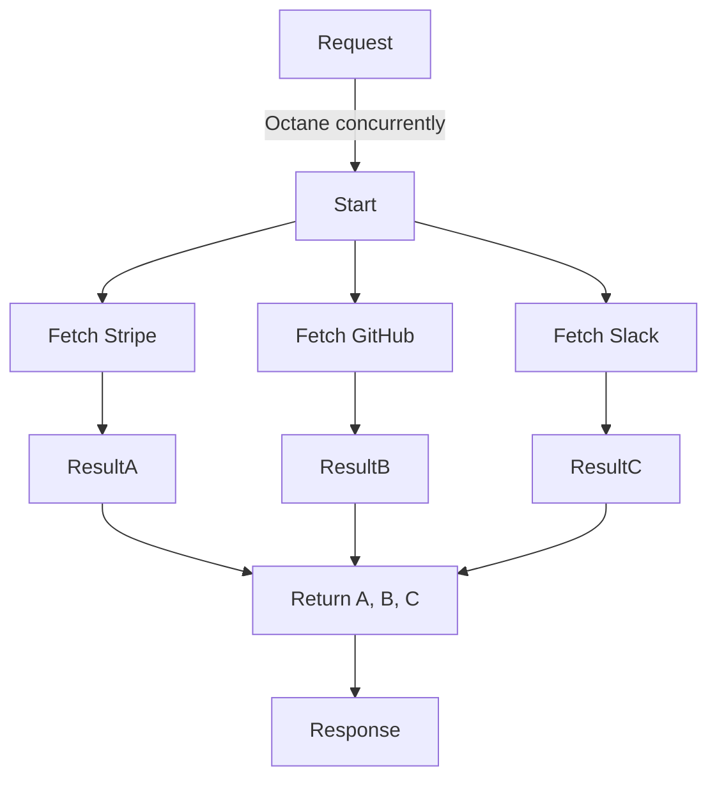

# ⚡ Laravel Octane (The Server Architecture)

> **"Keep the application alive."**
> Understanding how Swoole/RoadRunner change the traditional PHP lifecycle.

---

## 🟢 1. Traditional PHP-FPM (The Old Way)
Each request kills the application. Slowest.

> **Bottleneck**: Bootstrapping framework takes 30-50ms PER REQUEST.

---

## 🚀 2. Laravel Octane (The New Way)
The application stays in RAM.

> **Advantage**: Framework Boot takes 0ms per request. Response time drops to 2-3ms total.

---

## 🧹 3. Memory Management (Garbage Collection)
Wait, globals leak!

## 🔄 4. Concurrent Tasks (Background Co-Routines)
Running multiple tasks in parallel without blocking.

