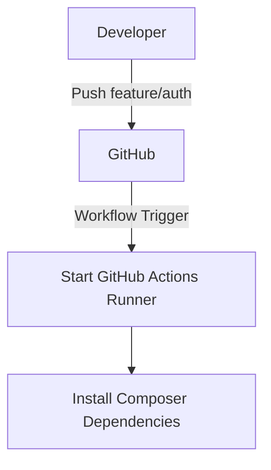
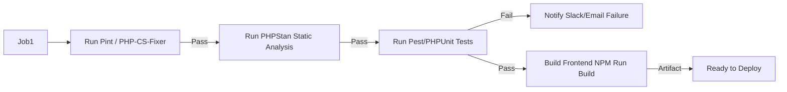
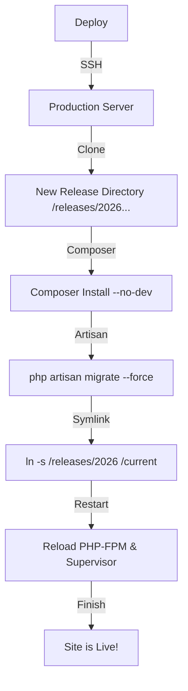
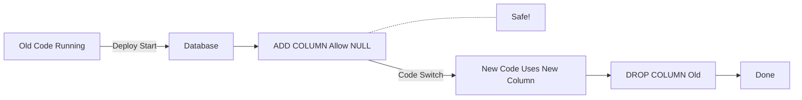

# 🔄 Continuous Integration & Deployment (CI/CD) Pipeline

> **"From `git push` to Production."**
> A visualization of a modern Laravel deployment workflow using GitHub Actions.

---

## 🟢 1. The Trigger (Git Push)
When a developer [Developer A] pushes code to the repository.

## 🧪 2. The Build Pipeline (CI)
Automated checks to ensure quality.

## 🚀 3. The Deployment (CD)
Zero-downtime deployment to production (Forge/Envoyer/Vapor).

## 🔄 4. Database Migrations (Zero Downtime)
Handling schema changes without locking.

