# 📊 The Ultimate Laravel Diagram Library (50+ Visuals)

> **"Visualizing the Magic."**
> A comprehensive collection of Mermaid.js diagrams covering Core, Database, Security, and Architecture.

---

## 🟢 Core & Lifecycle

### 1. The Request Lifecycle (Simplified)
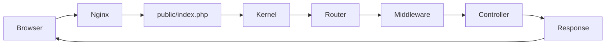

### 2. Service Container Binding
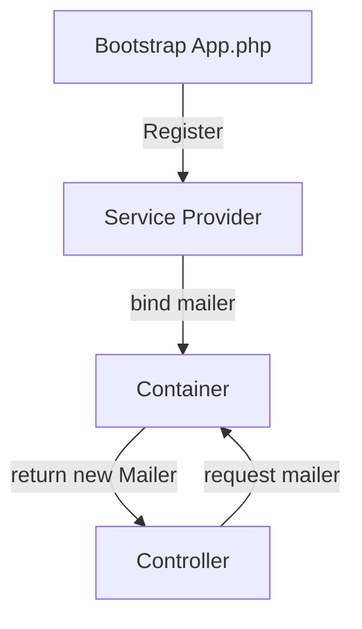

### 3. Middleware Stack Order
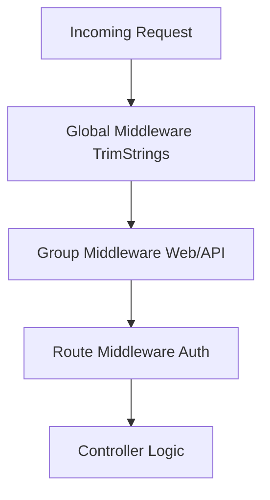

### 4. Event & Listener Flow
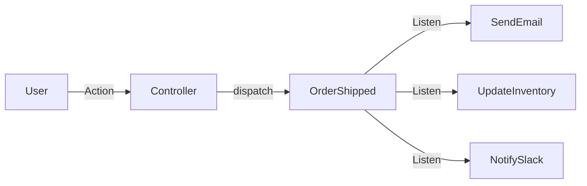

### 5. Facade Root Resolution
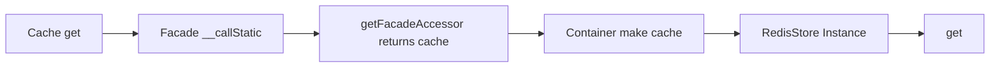

### 6. Service Provider Lifecycle
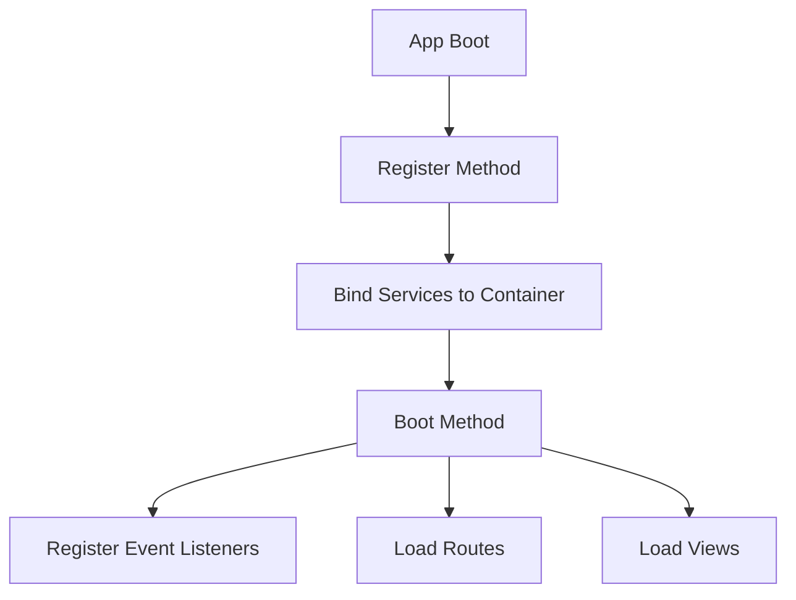

### 7. Exception Handling Flow
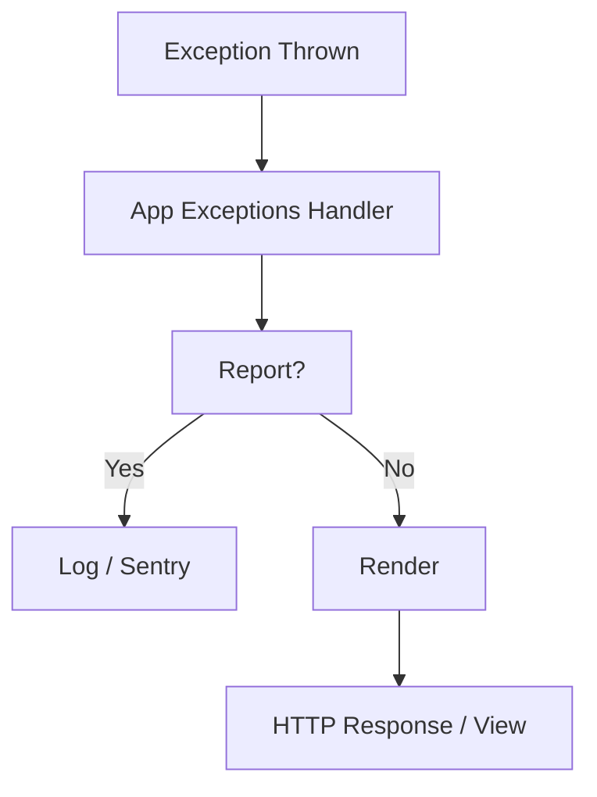

### 8. Console Kernel Schedule
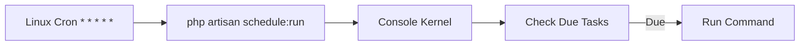

---

## 🟠 Database & Eloquent

### 9. Eloquent Query Building
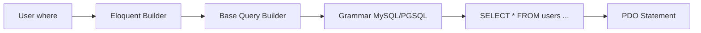

### 10. Model Hydration
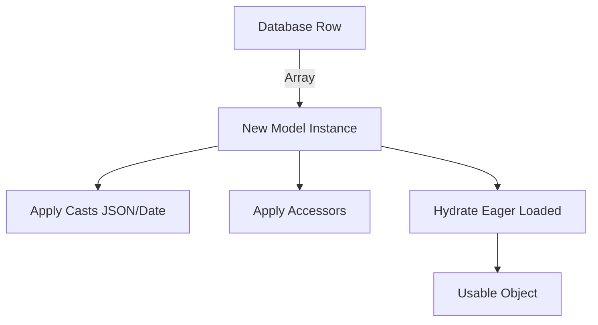

### 11. Migration Process
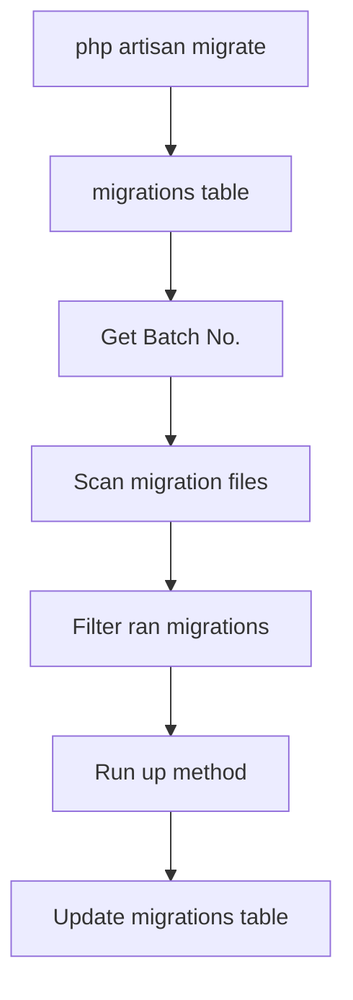

### 12. Seeder Factory Flow
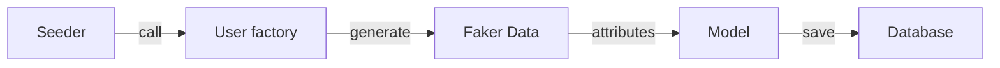

### 13. Polymorphic Relationship
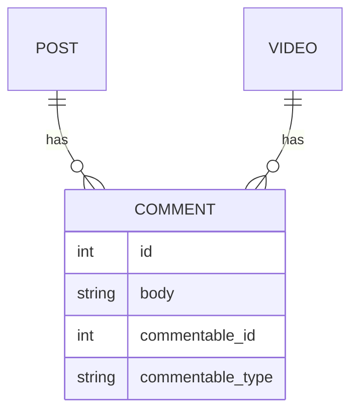

### 14. Many-to-Many (Pivot)
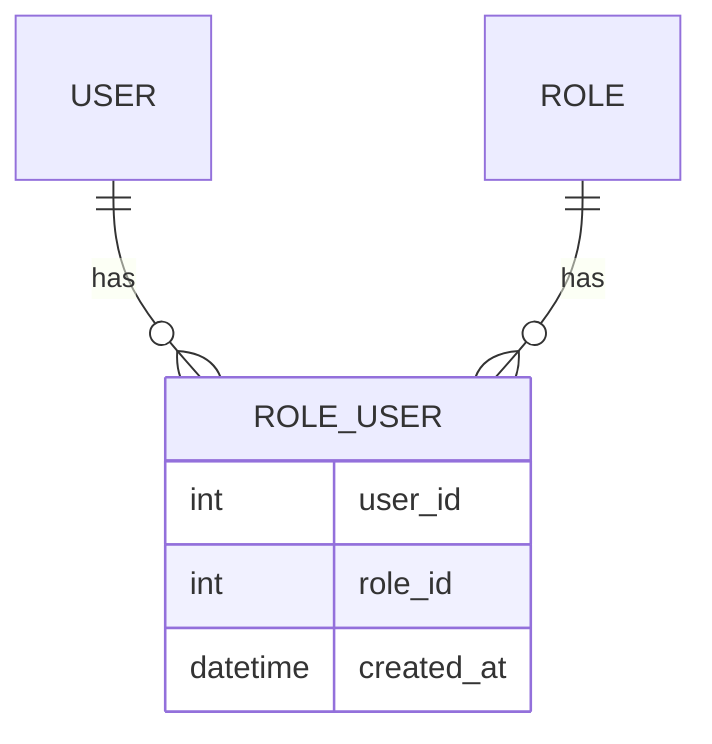

### 15. Soft Deletes
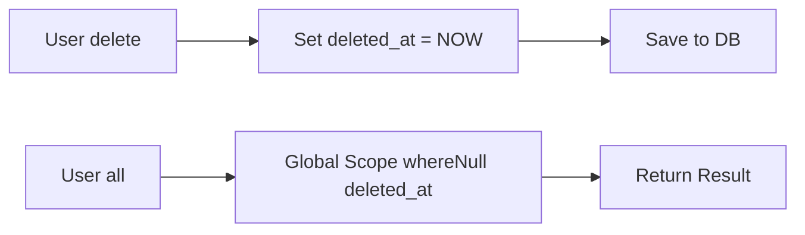

### 16. Transaction (ACID)
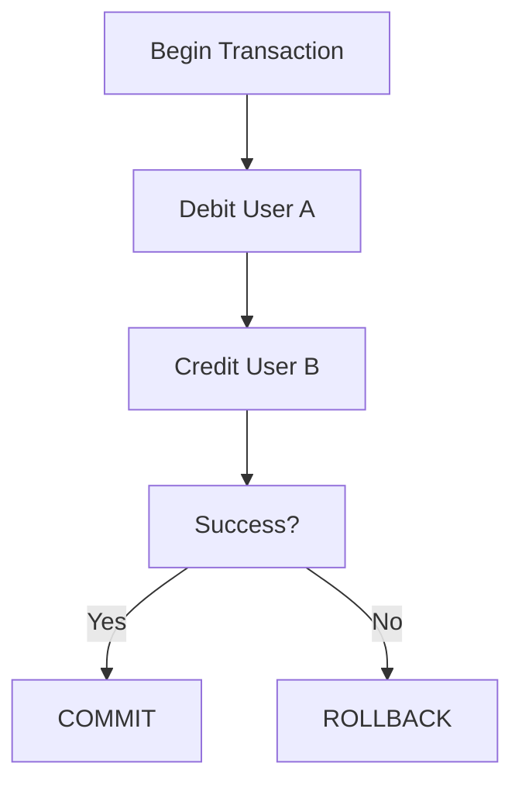

---

## 🔴 Security & Auth

### 17. Authentication Guard Flow
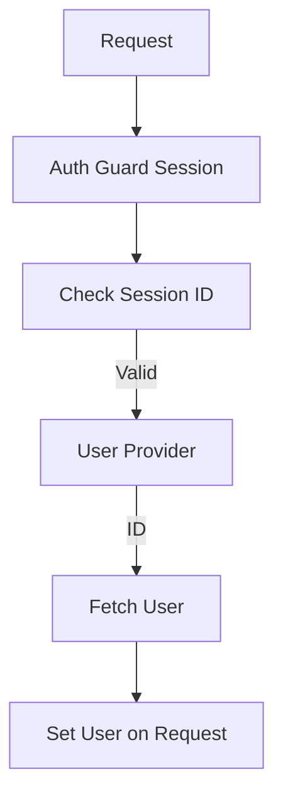

### 18. CSRF Protection
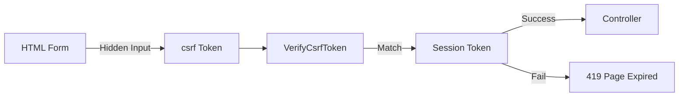

### 19. Password Hashing (Bcrypt)
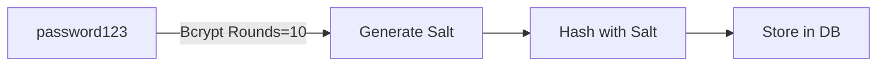

### 20. Gate/Policy Authorization
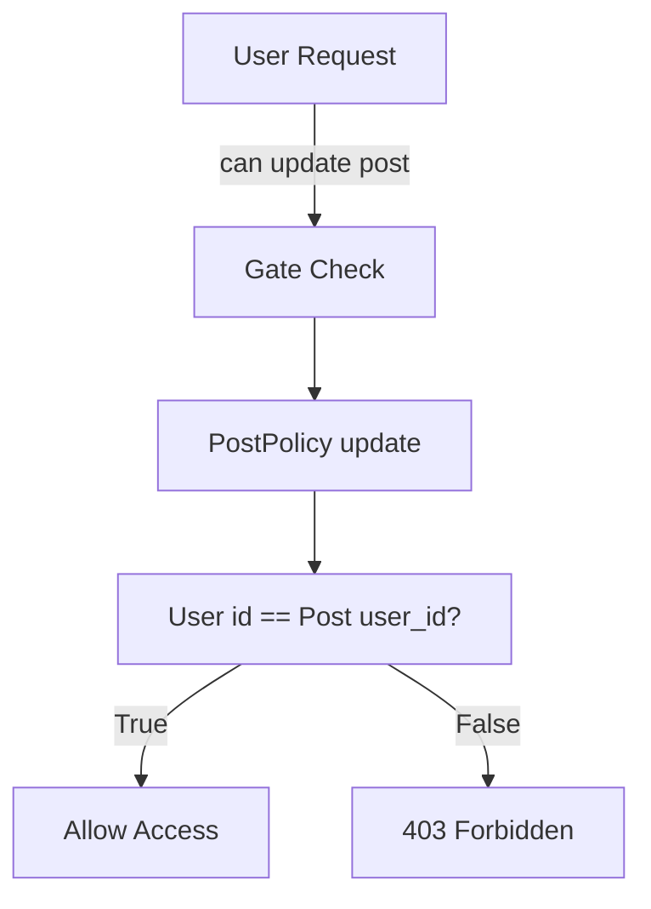

### 21. Sanctum SPA Auth
```mermaid
graph TD
    Browser -->|Login| API
    API -->|Set Cookie| Cookie[laravel_session HttpOnly]
    Browser -->|Next Req| Middleware[EnsureFrontendRequestsAreStateful]
    Middleware -->|Decrypt| Cookie
    Cookie -->|Auth| User
```

### 22. API Token (Bearer)
```mermaid
graph LR
    Header[Authorization: Bearer xyz] --> Guard[Sanctum Guard]
    Guard --> DB[personal_access_tokens]
    DB -->|Match Hash| User
```

---

## ⚡ Architecture & Queues

### 23. Job Dispatching
```mermaid
graph LR
    Code[dispatch Job] --> Bus[Command Bus]
    Bus --> Queue[Queue Manager]
    Queue -->|Serialize| Payload[JSON Payload]
    Payload --> Driver[Redis/SQS]
```

### 24. Worker Processing
```mermaid
graph TD
    Worker[php artisan queue:work] -->|Pop| Job[Get Job]
    Job -->|Unserialize| Class[Job Class]
    Class -->|Handle| Logic[Run Logic]
    Logic --> Result{Exception?}
    Result -->|No| Delete[Delete Job]
    Result -->|Yes| Fail[Mark Failed / Retry]
```

### 25. Event Broadcasting (WebSockets)
```mermaid
graph LR
    App -->|Broadcast| Redis[Redis Pub/Sub]
    Redis -->|Push| Server[Reverb / Pusher]
    Server -->|WS| Browser[Laravel Echo]
```

### 26. Task Scheduling
```mermaid
graph TD
    Timer[Minute Ticker] --> Schedule[Console Kernel]
    Schedule --> Tasks[Defined Tasks]
    Tasks -->|Filter| Due[Is Due?]
    Due -->|Yes| Process[Run in Background]
```

### 27. Scout Search
```mermaid
graph LR
    Model[Save Model] --> Observer[Model Observer]
    Observer -->|Sync| Engine[Meilisearch/Algolia]
    Search[User Search] --> Engine
    Engine -->|IDs| DB
    DB -->|Models| User
```

### 28. Notification Channels
```mermaid
graph TD
    Notify[User->notify InvoicePaid] --> Channel[On Demand?]
    Channel -->|Mail| SMTP
    Channel -->|Slack| Webhook
    Channel -->|Database| Table[notifications table]
    Channel -->|SMS| Twilio
```

### 29. Horizon Architecture
```mermaid
graph TD
    Master[Horizon Master] -->|Spawns| Supervisor1
    Master -->|Spawns| Supervisor2
    Supervisor1 -->|Forks| Worker1
    Supervisor1 -->|Forks| Worker2
    Worker1 --> Redis
```

### 30. Octane Request Life
```mermaid
graph TD
    Start[Boot Worker] --> RAM[Load App to RAM]
    Req[Request 1] --> RAM
    RAM --> Resp[Response 1]
    Req2[Request 2] --> RAM
    Note[Framework NOT Rebooted]
```

---

## 🌐 Patterns & Advanced

### 31. Repository Pattern
```mermaid
graph LR
    Controller -->|Interface| Repo[UserRepositoryInterface]
    Repo -->|Impl| Concrete[EloquentUserRepository]
    Concrete --> Model[User Model]
```

### 32. Decorator Pattern
```mermaid
graph TD
    Req[Request] --> Decorator1[LogRequest]
    Decorator1 --> Decorator2[CacheResponse]
    Decorator2 --> Core[Core Logic]
    Core --> Decorator2
    Decorator2 --> Decorator1
    Decorator1 --> Resp[Response]
```

### 33. Observer Pattern
```mermaid
graph LR
    Subject[User Model] -->|Event| Observer1[UserObserver created]
    Subject -->|Event| Observer2[UserObserver updated]
    Subject -->|Event| Observer3[UserObserver deleted]
```

### 34. Strategy Pattern
```mermaid
graph TD
    Context[PaymentService] -->|Interface| Strategy[PaymentGateway]
    Strategy --> Stripe[Stripe]
    Strategy --> PayPal[PayPal]
    Strategy --> Bank[Bank Transfer]
```

### 35. Adapter Pattern
```mermaid
graph LR
    App[App Code] -->|Call| Interface[StorageInterface]
    Interface -->|Adapter| S3Adapter[S3 Adapter]
    Interface -->|Adapter| LocalAdapter[Local Adapter]
    S3Adapter --> AWS[AWS S3]
    LocalAdapter --> Disk[Local Disk]
```

### 36. Chain of Responsibility (Middleware)
```mermaid
graph LR
    Req[Request] --> Step1[CheckMaintenance]
    Step1 --> Step2[CheckBan]
    Step2 --> Step3[CheckAuth]
    Step3 --> App[Application Core]
```

### 37. Singleton (Container)
```mermaid
graph TD
    Call1[app db] --> Instance[Shared Instance]
    Call2[app db] --> Instance
    Call3[app db] --> Instance
    Note[One Object in Memory]
```

### 38. Factory Method
```mermaid
graph LR
    Code[User Code] -->|Notification send| Manager[ChannelManager]
    Manager -->|createDriver| Driver[SpecificDriver]
```

### 39. Proxy Pattern (Lazy Loading)
```mermaid
graph LR
    User -->|Access| Posts[Relation Proxy]
    Posts -->|Not Loaded| DB[Query DB]
    Posts -->|Loaded| Return[Return Collection]
```

### 40. Active Record (Eloquent)
```mermaid
graph LR
    Obj[User Object] -->|has| Data[Properties]
    Obj -->|has| Save[save method]
    Obj -->|has| Delete[delete method]
    Note[Data + Behavior Mixed]
```

---

## 🛠 Deployment & DevOps

### 41. Git Deployment
```mermaid
graph TD
    Local[Git Push] --> Repo[GitHub]
    Repo -->|Webhook| Server[Forge/Envoyer]
    Server --> Pull[Git Pull]
    Server --> Install[Composer Install]
    Server --> Migrate[Artisan Migrate]
    Server --> Link[Symlink Current]
```

### 42. Docker Structure (Sail)
```mermaid
graph TD
    Sail -->|Compose| Net[Network]
    Net --> PHP[Laravel App]
    Net --> MySQL
    Net --> Redis
    Net --> Mailpit
```

### 43. CI/CD Pipeline
```mermaid
graph LR
    Push --> Test[Run Tests Pest]
    Test -->|Pass| Lint[Run Pint/Stan]
    Lint -->|Pass| Build[Build Assets]
    Build -->|Pass| Deploy[Deploy to Prod]
```

### 44. Load Balancer
```mermaid
graph TD
    User --> LB[Load Balancer]
    LB --> S1[Server 1]
    LB --> S2[Server 2]
    S1 --> DB[Database]
    S2 --> DB
    S1 --> Redis
    S2 --> Redis
```

### 45. Blue/Green Deployment
```mermaid
graph TD
    LB -->|Traffic| Blue[Blue Current]
    Green[Green New] -->|Test| QA
    Note[Switch LB to Green]
    LB -->|Traffic| Green
```

### 46. Serverless (Vapor)
```mermaid
graph LR
    Req --> API[API Gateway]
    API --> Lambda[Lambda Function PHP]
    Lambda --> RDS[RDS Proxy]
    Lambda --> S3[Storage]
    Lambda --> SQS[Queue]
```

### 47. Cache Aside Strategy
```mermaid
graph TD
    Req --> Cache[In Cache?]
    Cache -->|Yes| Return
    Cache -->|No| DB[Query DB]
    DB --> Save[Save to Cache]
    Save --> Return
```

### 48. Database Replication
```mermaid
graph TD
    App -->|Write| Primary[Primary DB]
    Primary -->|Sync| Read1[Read Replica 1]
    Primary -->|Sync| Read2[Read Replica 2]
    App -->|Read| Read1
```

### 49. CDN Asset Delivery
```mermaid
graph LR
    User -->|Request image| CDN[Cloudflare/Cloudfront]
    CDN -->|Hit| Return
    CDN -->|Miss| Server
    Server --> CDN
```

### 50. Microservices Flow
```mermaid
graph TD
    User --> Gateway[API Gateway]
    Gateway --> Auth[Auth Service]
    Gateway --> Billing[Billing Service]
    Gateway --> Product[Product Service]
    Billing --> Bus[Event Bus]
    Bus --> Product
```
